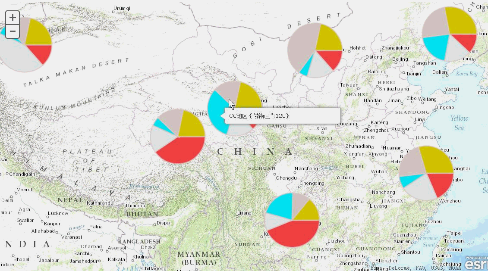

#可交互的饼状地图 PiesLayer
####[演示地址](http://kunkun12.github.io/PiesLayer)
##PiesLayer是什么?
一个基于ArcGIS API for Javascript 实现的饼图渲染图层，作为一个Layer提供

##PiesLayer介绍？

* 支持AMD方式的加载
* 使用Canvas动态生成图片，需要浏览器支持Canvas，IE8+，FF，Chrome，Safari
* 扩展了GraphicsLayer。兼容GraphicsLayer的属性和方法
* 扩展了鼠标的事件参数，监听这些事件可以实现与饼图的交互。
* 个性化地定义饼图各部位的颜色，边框颜色。
* 构造函数中初始化饼图数据源，也可以使用add方法动态添加饼图


##PiesLayer API介绍
为方便大家使用，封装了模块 ，主要的方法与属性介绍如下（一下仅列出扩展的属性和方法）
### 主要属性：
 

构造函数: PiesLayer(option) 一个JSON对象类型的参数。具体内容如下。

* r ： 数字类型  可选 
        
        设置饼图的半径（像素），如果忽略该参数则使用默认值为100

* colors ： 数组类型，必选。

    	设置饼图各指标的颜色：格式如
    	{'name1':"#F7464A",'name2':'#E2EAE9','name3':'#02EAF9','name4':'#D4CCC5','name5':'#D4CC00'}

* linecolor ：字符串类型 可选。，默认是值为'rgba(229, 205, 205, 0.78)'
    
    	饼图边框的颜色，可以为16进制形式，如#FFFFFF，也可以使用颜色的名字，如red.还可以通过rgba构造如'rgba(200, 200, 200, 0.75)'
* selectedlinecolor 字符串类型 可选。

        	饼图被选中部分的边框颜色。默认值为 "#0F66E9"
* spatialReference 空间参考，默认为web mecartor

* data： 对象数组 可选 。作为饼图的数据的数组。格式如
        
         [{
     			x: 13567611.673366752,
	 			y:5174359.8470072355,
	 			attributes:{'name':'AA地区','指标一':30,'指标二':40,'指标三':50,'指标四':60}
			},
			{
	 			x: 12041317.092568759,
	 			y:4988464.994217737,
	 			attributes:{'name':'BB地区','指标一':50,'指标二':60,'指标三':20,'指标四':160}
			}
			]
### 主要的方法
* add(p) 增加pie到Layer中，p的格式为
        {x: 13567611.673366752,y:5174359.8470072355,attributes:{'name':'AA地区','指标一':30,'指标二':40,'指标三':50,'指标四':60,'指标五':70}}
* setPieRadius(r) 改变饼图的半径.
* 
### 事件
    与GraphicsLayer的事件一致。主要对click ，mouse-move ，mouse-over，mouse-down mouse-up等事件的参数进行了扩展。可以获得 被选择饼图的数据源，以及被选择部分的数据。通过监听这些事件获得被选择部分的数据以达到交互的目的。如可以进行弹出infowindow 等其他操作
##示例
```javascript
//首先在dojoConfig里面配置 扩展包的路径参数
 var dojoConfig = { 
        parseOnLoad: true,
        packages: [{
          "name": "extras",
          "location": location.pathname.replace(/\/[^/]+$/, '') + "/extras"
        }]
      };
//接下来的代码也很简单。类似在graphicLayer中添加graphic。
 require(["esri/map", "esri/layers/ArcGISTiledMapServiceLayer", "dojo/dom", "dojo/on", "dojo/dom-class", 
"extras/PiesLayer","dojo/domReady!"],
      function(Map, ArcGISTiledMapServiceLayer, dom, on, domClass,PiesLayer) {
	    var map = new Map("map", {
	      basemap: "topo",
	      center: [100.69828872684525, 34.24237112174851], // long, lat
	      zoom: 5,
	      sliderStyle: "small"
	    });
	 var data1={
	 			x: 13567611.673366752,
	 			y:5174359.8470072355,
	 			attributes:{'name':'AA地区','指标一':30,'指标二':40,'指标三':50,'指标四':60}
			};
	 var data2={
	 			x: 12041317.092568759,
	 			y:4988464.994217737,
	 			attributes:{'name':'BB地区','指标一':50,'指标二':60,'指标三':20,'指标四':160}
	 		};
	 var data3={
			 	x: 11131410.707862262,
	 			y:4328049.069833989,
	 			attributes:{'name':'CC地区','指标一':50,'指标二':60,'指标三':120,'指标四':60}
	 		};
 	
	 var colors={'指标一':"#F7464A",'指标二':'#E2EAE9','指标三':'#02EAF9','指标四':'#D4CCC5'};
	//构造 PiesLayer
 	var pielayer= new PiesLayer({colors:colors,r:120,data:[data1,data2]});
        map.addLayer(pielayer);
       //or 有也可以通过 pielayer.add()来动态地添加Pie 比如
       pielayer.add(data3);
       //在click ，mouse-move ，mouse-over，mouse-down mouse-up事件里 
       //可以获得被点击哪一个Pie的 哪一部分 如下
       on(pielayer,'click',function(e){
        var piedata=e.piedata; //通过e.piedata可以获得当前区域的所有的数据的集合
	//如{'name':'AA地区','指标一':30,'指标二':40,'指标三':50,'指标四':60,'指标五':70}
        var  name=piedata.name;
        var slecetedata=e.slecetedata;    
        map.infoWindow.setContent(name+"   "+JSON.stringify(slecetedata));
         map.infoWindow.show(e.mapPoint);
       }); 
	  });
```
